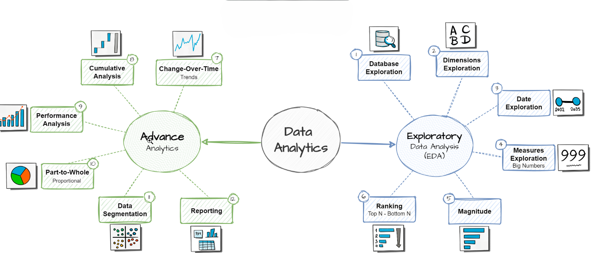

# SQL Data Analytics Project

This repository provides a curated set of **SQL scripts** to accelerate data exploration, analysis, and reporting.  
It covers a variety of analytical use cases, including:

- **Database Exploration** – Understand schemas, tables, and relationships.
- **Measures & Metrics** – Calculate KPIs and performance indicators.
- **Time-Based Trends** – Analyze seasonal patterns, growth rates, and historical comparisons.
- **Cumulative Analytics** – Track running totals, progressive changes, and rolling averages.
- **Segmentation** – Group and compare data across categories, demographics, or behaviors.

Each script follows **best SQL practices**, enabling **data analysts** and **BI professionals** to:
- Quickly extract insights
- Segment datasets
- Identify trends
- Build repeatable, reliable reports

---
## 🏗️ Project RoadMap



---

## 📂 Repository Structure
```
sql-data-analytics/
├── datasets/
│   ├── csv-files/
│   │   ├── bronze.crm_cust_info.csv
│   │   ├── bronze.crm_prd_info.csv
│   │   ├── bronze.crm_sales_details.csv
│   │   ├── bronze.erp_cust_az12.csv
│   │   ├── bronze.erp_loc_a101.csv
│   │   ├── bronze.erp_px_cat_g1v2.csv
│   │   ├── gold.dim_customers.csv
│   │   ├── gold.dim_products.csv
│   │   ├── gold.fact_sales.csv
│   │   ├── gold.report_customers.csv
│   │   ├── gold.report_products.csv
│   │   ├── placeholder
│   │   ├── silver.crm_cust_info.csv
│   │   ├── silver.crm_prd_info.csv
│   │   ├── silver.crm_sales_details.csv
│   │   ├── silver.erp_cust_az12.csv
│   │   ├── silver.erp_loc_a101.csv
│   │   └── silver.erp_px_cat_g1v2.csv
│   └── DataWarehouseAnalytics.bak
├── docs/
│   ├── placeholder
│   └── project-road-map.png
├── README.md
└── scripts/
    ├── 00_init_database.sql
    ├── 01_database_exploration.sql
    ├── 02_dimensions_exploration.sql
    ├── 03_date_range_exploration.sql
    ├── 04_measures_exploration.sql
    ├── 05_magnitude_analysis.sql
    ├── 06_ranking_analysis.sql
    ├── 07_change_over_time_analysis.sql
    ├── 08_cumulative_analysis.sql
    ├── 09_performance_analysis.sql
    ├── 10_data_segmentation.sql
    ├── 11_part_to_whole_analysis.sql
    ├── 12_report_customers.sql
    ├── 13_report_products.sql
    └── placeholder

```

## 🌟 About Me

Hi there! I'm **Alauddin Jahin**, . I’m a Senior Full Stack Developer and I love to share my knowledge and make working with data enjoyable and engaging!

## ☕ Stay Connected

Let's stay in touch! Feel free to connect with me on the following platforms: <br/>
[](https://www.linkedin.com/in/alauddin-jahin-8008b1183)
[](https://alauddinjahin.vercel.app)

